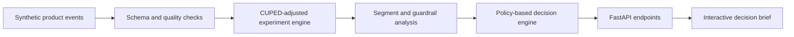

# LaunchLens

**An experimentation and causal decision platform for AI products.** 

LaunchLens turns a noisy product launch into an executive recommendation by combining experiment design, CUPED variance reduction, guardrail monitoring, heterogeneous treatment effects and AI quality/cost analysis.

## Why

Shipping an AI feature is not just a question of whether engagement increased. Product teams also need to know:

- Is the lift statistically credible and practically meaningful?
- Did latency, safety or cost regress?
- Which users benefited and which were harmed?
- Is the launch still attractive after accounting for inference cost?

LaunchLens answers those questions in one reproducible workflow. The included scenario simulates an AI discovery assistant tested across 12,000 users, with novelty effects, user segments, pre-period behavior, latency, quality scores, safety flags and inference cost.

## Demo

```bash
python -m venv .venv
source .venv/bin/activate
pip install -e '.[dev]'
launch-lens
```

Open [http://localhost:8000](http://localhost:8000). The API docs are at `/docs`.

Or run the full analysis without a server:

```bash
python -m launch_lens.cli analyze --seed 42
```

## What is technically interesting

1. **Deterministic synthetic event generation** with heterogeneous effects and correlated pre-period covariates.
2. **CUPED adjustment** estimated only from pre-treatment behavior, reducing variance without post-treatment leakage.
3. **Welch inference and confidence intervals** implemented transparently rather than hidden behind a dashboard abstraction.
4. **Guardrail policy engine** that separates statistical evidence from launch criteria.
5. **Segment analysis with Benjamini–Hochberg correction** to reduce false discoveries.
6. **Decision layer** that combines primary lift, downside risk, quality, latency, safety, and unit economics into a reviewable recommendation.

## Architecture



The statistical core is framework-independent and fully tested. FastAPI is a thin delivery layer; the browser UI consumes the same JSON contract available to any downstream system.

## Repository map

```text
src/launch_lens/
  simulation.py   reproducible event level scenario.
  statistics.py   inference, CUPED and multiplicity correction.
  analysis.py     metrics, segments, economics, decision policy
  api.py          typed HTTP contract and static app
web/              zero-build responsive product UI
tests/            statistical and API behavior
docs/             methodology and interview narrative
```

## Product judgment encoded in the system

LaunchLens deliberately does **not** let a significant engagement win automatically produce “ship.” A launch must also satisfy explicit quality, safety, latency, and economic constraints. Results can be `SHIP`, `ITERATE`, or `HOLD`, and every outcome includes human-readable reasons and risks.

See [docs/methodology.md](docs/methodology.md) for assumptions and [docs/interview-guide.md](docs/interview-guide.md) for a concise walkthrough, tradeoffs, and extensions.

## Tests

```bash
pytest
```

Tests cover deterministic simulation, treatment assignment balance, known-effect recovery, CUPED variance reduction, false-discovery correction, decision policy behavior, and the HTTP contract.

## Responsible use

The dataset is synthetic and contains no personal data. Segment results are exploratory and multiplicity-adjusted. LaunchLens surfaces subgroup harm; it does not automate consequential decisions or claim that statistical significance implies product value.

